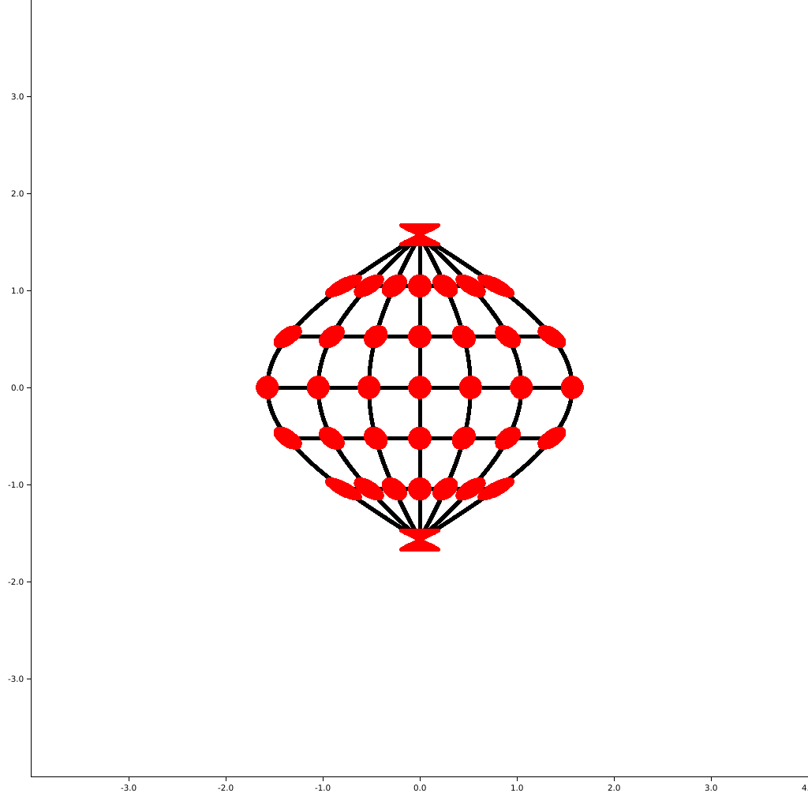

## Map Projections
This is an implementation of many map projections as defined in the book
"Flattening the Earth" by John P. Snyder. It uses the 
[plotters](https://github.com/38/plotters) library to draw new projections
to the screen. 

Several example projections are shown below, in addition to more in the
maps directory. 

There will be a website where projections can be generated on the fly soon.

This was created in Rust using Vim. The functions for map projections are as defined
in "Flattening the Earth" by John P. Snyder.

