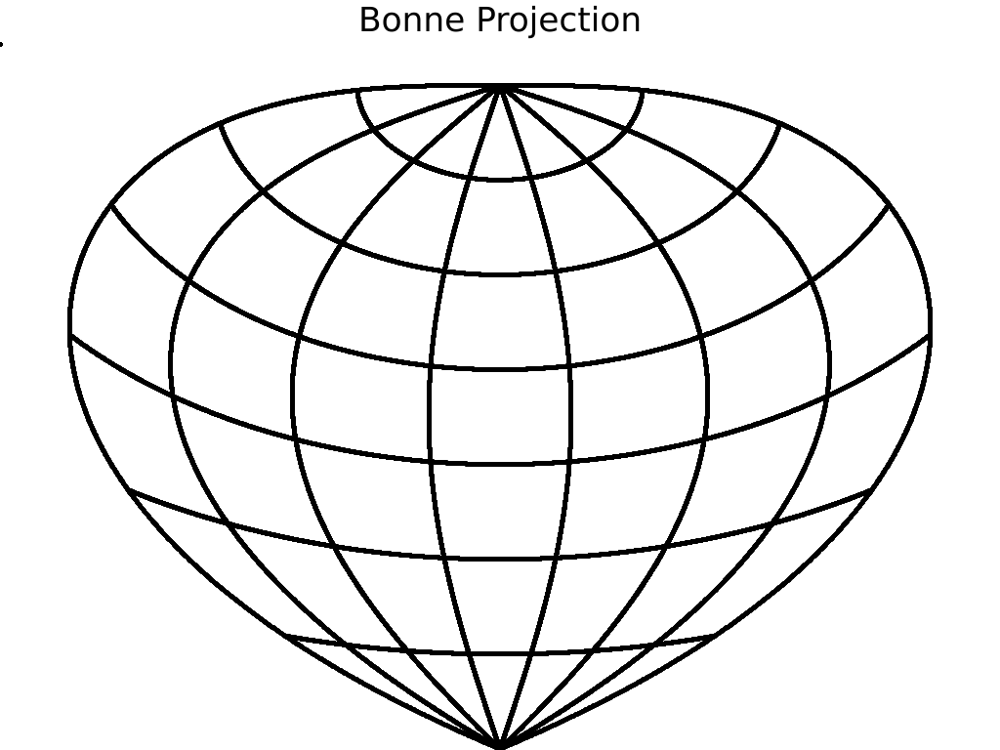
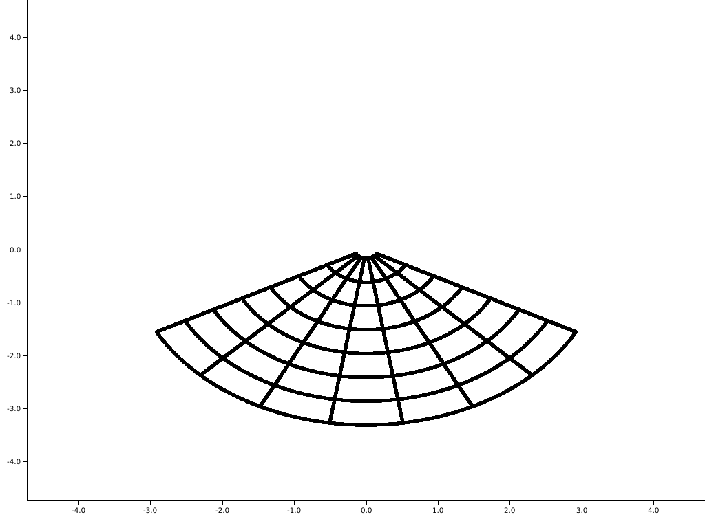
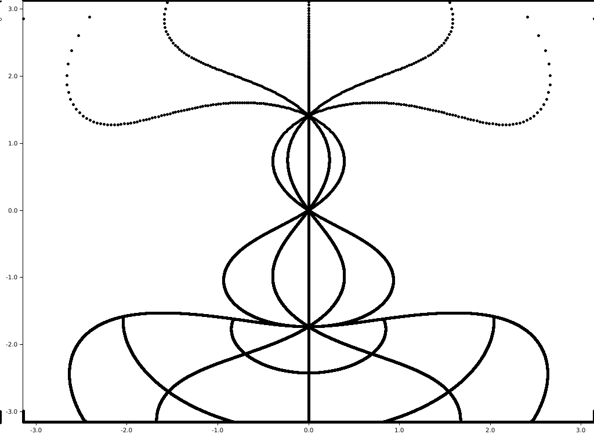

## Map Projections
This is an WIP implementation of many map projections as defined in the book
"Flattening the Earth" by John P. Snyder. It uses the 
[plotters](https://github.com/38/plotters) library to draw new projections
to the screen. 

Several example projections are shown below, in addition to more in the
maps directory. To add your own mapping function, write a new `pub fn`
in the `projections.rs` file, and call it in `main.rs` where indicated.

You man also add shapes to observe the distortion caused by different projections
by adding shapes where marked in the `main.rs` file.

Output from `cargo run` 
is stored in a file called `map.png` relative to the current directory.

Interesting visuals can be by chaining map projections, such as the "map" shown in 
`maps/mercator-bonne-simple_equidistant_conic.png` and at the bottom of this page.

This was created in Rust using Vim. The functions for map projections are as defined
in "Flattening the Earth" by John P. Snyder.

### Combination map

